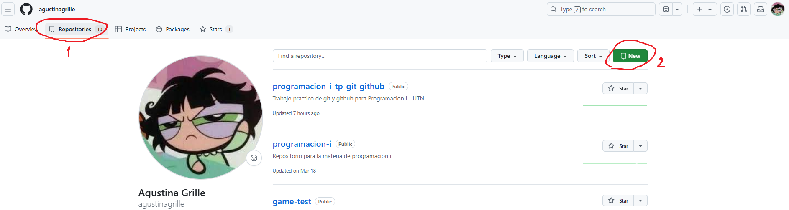
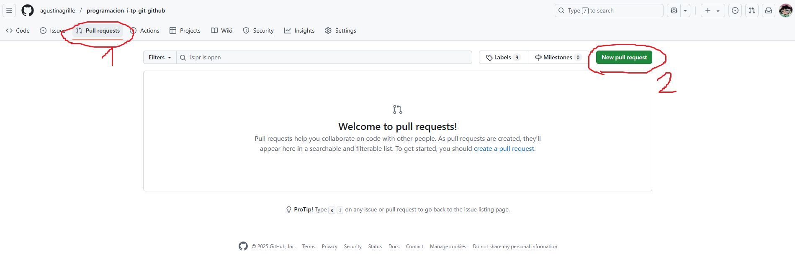
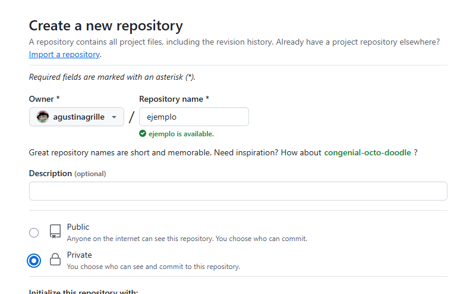

# 📦 Trabajo Practico Github / Git

Trabajo práctico para la materia de programación I - UTN

---

- [Autor/a: Agustina Grille](https://github.com/agustinagrille) 
---

## 📖 Cuestionario

- **¿Qué es GitHub?**  
  GitHub es una plataforma online donde se puede alojar y compartir proyectos. 

- **¿Cómo crear un repositorio en GitHub?**  
 En la consola, con: 
 `git init`
 En el sitio web:
 

- **¿Cómo crear una rama en Git?**  
  En la consola, con el comando:  
  `git branch nombre-de-la-rama`

- **¿Cómo cambiar a una rama en Git?**  
En la consola, con el comando:  
  `git checkout nombre-de-la-rama`

- **¿Cómo fusionar ramas en Git?**  
  Primero cambiá a la rama a la que querés fusionarle otra (Por ejemplo `master`) con el comando: 
  `git checkout main`  
  Una vez sobre la rama "principal" a la que le mergearemos la otra rama, usaremos el comando:  
  `git merge nombre-de-la-rama`
  ¡Y listo! (Aunque en este paso tenemos que tener en cuenta que pueden aparecer conflictos entre ramas! En ese caso, se puede resolver desde el IDE, de manera local, o directamente en tu gestor de repositorios -Github o Gitlab, o el que uses-)

- **¿Cómo crear un commit en Git?**  
  Primero agregás los cambios con el comando:  
  `git add .`   (El punto indica que vas a agregar todos los files que hayan tenido cambios, hayan sido eliminados o agregados, asi que si necesitas únicamente subir algunos especificos, reemplaza el punto por el path de cada archivo. Tambien podés usar git add . y los archivos que no querés subirlos, agregarlos a un documento .gitignore)
  Luego los guardás con un mensaje, un commit, que va a servir como referencia de los cambios que realizas:  
  `git commit -m "Mensaje claro y conciso del cambio"`
  Es importante que el mensaje del commit sea claro, lo mas corto y conciso posible.

- **¿Cómo enviar un commit a GitHub?**  
  Usando el comando:
  `git push origin nombre-de-la-rama`
  Si vas a hacer un push por primera vez en una rama nueva, probablemente requieras del comando:
  `--set-upstream nombre-del-proyecto nombre-de-la-rama`

- **¿Qué es un repositorio remoto?**  
  Es el repositorio que está en internet (como por ejemplo, subido en GitHub), no en tu computadora.

- **¿Cómo agregar un repositorio remoto a Git?**  
  Usando el comando:
  `git remote add origin https://github.com/usuario/repositorio.git`

- **¿Cómo empujar cambios a un repositorio remoto?**  
  Usando el comando:
  `git push origin nombre-de-la-rama`

- **¿Cómo tirar de cambios de un repositorio remoto?**  
  Usando el comando:
  `git pull origin nombre-de-la-rama`

- **¿Qué es un fork de repositorio?**  
  Es una copia de un repositorio que podés modificar sin afectar el original.

- **¿Cómo crear un fork de un repositorio?**  
  Usando el comando:
  `git clone ssh-del-repositorio-o-url-del-repositorio`

- **¿Cómo enviar una solicitud de extracción (pull request) a un repositorio?**  
  Desde el sitio web podemos acceder ingresando el repositorio y seleccionado la siguiente opción:
  

- **¿Cómo aceptar una solicitud de extracción?**  
  Si sos dueño del repositorio (o tenes los roles y permisos requeridos para hacerlo), vas a "Pull requests", revisás y hacés clic en "Merge".
  ¡Una buena practica en esta instancia es realizar una code review de los cambios para verificar que no hayan posibles errores!

- **¿Qué es una etiqueta en Git?**  
  Es una marca que se usa para identificar versiones importantes del código (como "v1.0").

- **¿Cómo crear una etiqueta en Git?**  
  `git tag nombre-de-la-etiqueta`

- **¿Cómo enviar una etiqueta a GitHub?**  
  `git push origin nombre-de-la-etiqueta`

- **¿Qué es un historial de Git?**  
  Es una lista de todos los commits realizados en el proyecto. Se puede consultar a través de la consola o del historial de ramas en el sitio web de tu gestor de proyectos.

- **¿Cómo ver el historial de Git?**  
  `git log`

- **¿Cómo buscar en el historial de Git?**  
  `git log --grep="palabra clave"` o usar `/` dentro del `git log`.

- **¿Cómo borrar el historial de Git?**  
  Se puede realizar con el comando: 
  `git rebase -i` Aunque no es una buena practica ni se recomienda ya que pueden perderse detalles importantes del historial de commits y versiones puntuales.

- **¿Qué es un repositorio privado en GitHub?**  
  Es un repositorio que solo pueden ver vos y las personas que invites, generalmente es una buena practica en los entornos laborales.

- **¿Cómo crear un repositorio privado en GitHub?**  
  Al crear el repositorio en el site, elegí la opción "Private".

- **¿Cómo invitar a alguien a un repositorio privado en GitHub?**  
  Vas a la pestaña "Settings" → "Collaborators" y agregás el nombre de usuario.
  (Completando antes contraseña o 2FA)

- **¿Qué es un repositorio público en GitHub?**  
  Es un repositorio visible para todo el mundo, todos pueden descargarlo sin requerir permisos.

- **¿Cómo crear un repositorio público en GitHub?**  
  Al crearlo, elegí la opción "Public". (Tal como en la imagen de la pregunta de creción de repositorio privado)

- **¿Cómo compartir un repositorio público en GitHub?**  
  Copiá la URL del repo y pasásela a quien quieras.
  Podés compartir la url o el ssh para clonas directamente, para este ultimo es importante que quien disponga del mismo utilice y configue una ssh de su computadora local.

